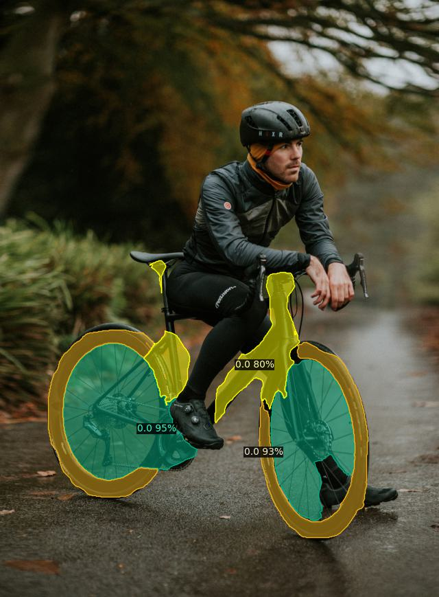

# PartDistillation: Learning Parts from Instance Segmentation 

PartDistillation learns to segment parts over 10k object categories without labels.

<p align="center">  </p>

> [**PartDistillation: Learning Parts from Instance Segmentation**](https://openaccess.thecvf.com/content/CVPR2023/papers/Cho_PartDistillation_Learning_Parts_From_Instance_Segmentation_CVPR_2023_paper.pdf),            
> [Jang Hyun Cho](https://janghyuncho.github.io), [Philipp Kr&auml;henb&uuml;hl](http://www.philkr.net), [Vignash Ramanathan](http://ai.stanford.edu/~vigneshr/),   
> *CVPR 2023 [[paper](https://openaccess.thecvf.com/content/CVPR2023/papers/Cho_PartDistillation_Learning_Parts_From_Instance_Segmentation_CVPR_2023_paper.pdf), [project page](https://janghyuncho.github.io/PartDistillation_website/)*]

Contact: janghyuncho7@utexas.edu


## :fire: News :fire: 

- PartDistillation demo is out! 
- ImageNet-1K training commands. 
- Initial commit. 

## Features 
- Unsupervised part segmentation using [emergent part signals](docs/ANALYSIS.md) from strong instance segmentation model. 
- Open-vocabulary object-part segmentation ([try out here](docs/DEMO.md)). 
- Self-training to discover novel parts over 10K object classes (**No part segmentation labels used!**). 
- Strong zero-shot and few-shot performance. 

## Installation 
Please see [installation instructions](docs/INSTALL.md). 


## DEMO

A short demo for PartDistillation with an image of a `person` and a `bicycle`: 

<p align="center">  </p>

Use the following command to segment each class:
```
python part_distillation_demo.py --input figs/input/bicycle_person.jpg --output figs/output/part_proposal/bicycle.jpg --vocabulary custom --confidence-threshold 0.1 --part-score-threshold 0.3 --custom_vocabulary bicycle --min-image-size 640 --non-overlapping
python part_distillation_demo.py --input figs/input/bicycle_person.jpg --output figs/output/part_proposal/person.jpg --vocabulary custom --confidence-threshold 0.1 --part-score-threshold 0.3 --custom_vocabulary person --min-image-size 640 --non-overlapping
```

If setup correctly, it should look like this:
<p align="center"> 
    
      
</p>

## Getting Started

See instructions for [preparing datasets](docs/DATASETS.md) and [preparing models](docs/WEIGHTS.md) to train PartDistillation.

## Using PartDistillation 

Please refer to our [demo](docs/DEMO.md) to explore. Also, see [checkpoints and inference](docs/MODELZOO.md) to learn about how to use PartDistillation.


## Training PartDistillation

For now, we prepared [compute-friendly training commands](docs/TRAINING_1K.md) with ImageNet-1K dataset. 
This setting only requires a single 8-GPU node and matches the reported results in zero-shot and few-shot benchmarks.  

*The [original training commands](docs/TRAINING.md) on ImageNet-21K here.*


## Benchmark Training and Evaluation

We have zero-shot and few-shot benchmarks on various datasets. Please see [benchmark training and evaluation](docs/BENCHMARK.md) for detail.

## License
Copyright (c) Meta Platforms, Inc. and affiliates.

This source code is licensed under the license found in the LICENSE file in the root directory of this source tree.

## Citation

If you find this project useful for your research, please cite our paper using the following bibtex.

    @InProceedings{Cho_2023_CVPR,
        author    = {Cho, Jang Hyun and Kr\"ahenb\"uhl, Philipp and Ramanathan, Vignesh},
        title     = {PartDistillation: Learning Parts From Instance Segmentation},
        booktitle = {Proceedings of the IEEE/CVF Conference on Computer Vision and Pattern Recognition (CVPR)},
        month     = {June},
        year      = {2023},
        pages     = {7152-7161}
    }