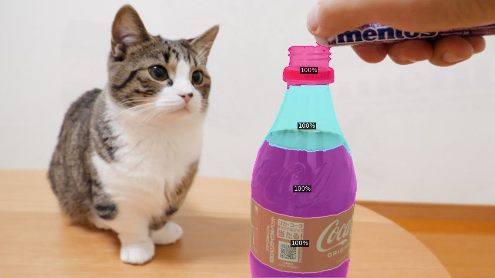

# Analyzing Pre-trained Features for Part Segmentation


### Visualizing Part Segments by Pixel Grouping
We first explore different pre-trained features and their capability of part segmentation. We provide a demo to try out:

```
python part_segment_demo.py --input figs/input/cat_and_cola.jpg --output figs/output/cola.jpg --vocabulary custom --confidence-threshold 0.1 --custom_vocabulary cola --min-image-size 640 --k 4 --weight-name coco_instance_seg --dcrf

python part_segment_demo.py --input figs/input/cat_and_cola.jpg --output figs/output/cat.jpg --vocabulary custom --confidence-threshold 0.1 --custom_vocabulary cat --min-image-size 640 --k 4 --weight-name coco_instance_seg --dcrf 
```
Above command reads `cat.jpg` image as input, and use [Detic](https://github.com/facebookresearch/Detic/tree/main) to first segment instance of the prompted class (`--custom_vocabulary`, `"cat"` in this case). Then it uses the pre-trained features specified with `--weight-name` to cluster the features to group pixels. 
- `--k` is used for the number of clusters.
- `--dcrf` is used for applying [dense-CRF](https://github.com/lucasb-eyer/pydensecrf) as post-processing. 
- See [here](https://github.com/facebookresearch/PartDistillation/part_segment_demo.py#L34) to find the available `weight-name` options. Please download the weights from Mask2Former ([here](https://github.com/facebookresearch/Mask2Former/blob/main/MODEL_ZOO.md)) and place them under `./weights/...` (see [here](./WEIGHTS.md)). 

If setup correctly, the result should look like below:

<p align="center"> 
     
    
 </p>


### Evaluating Part Segments on PartImageNet
Here we evaluate the pixel-grouping as part segments on PartImageNet dataset. 

```
python pixel_grouping_test_net.py --config-file configs/PixelGrouping.yaml --num-gpus 8 --num-machines 1 --eval-only \
PIXEL_GROUPING.NUM_SUPERPIXEL_CLUSTERS 4 \
PIXEL_GROUPING.DISTANCE_METRIC "dot" \
PIXEL_GROUPING.BACKBONE_FEATURE_KEY_LIST '["res3","res4"]' \
PIXEL_GROUPING.FEATURE_NORMALIZE False 
```
- *Change settings to explore different configuration.*
- *If W&B is setup, set `WANDB.DISABLE_WANDB` to `False` and use `WANDB.VIS_PERIOD_TEST` to visualize the part segments.*