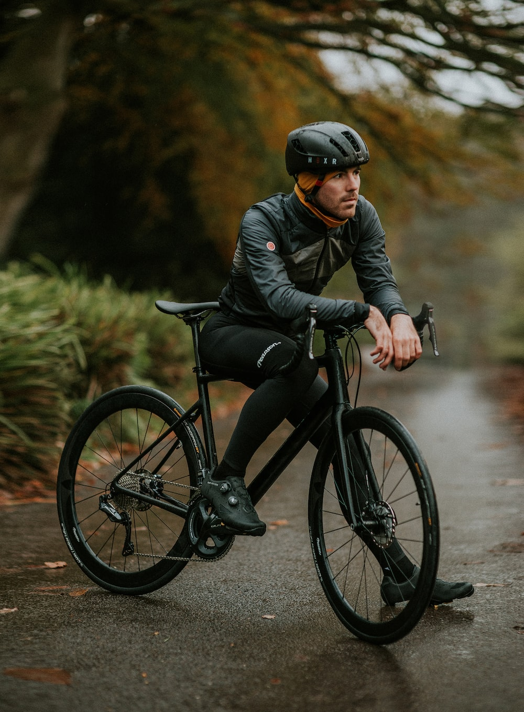
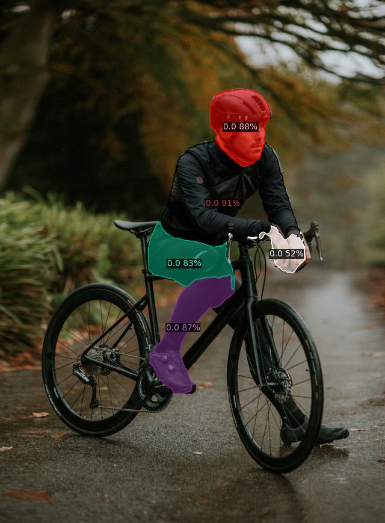
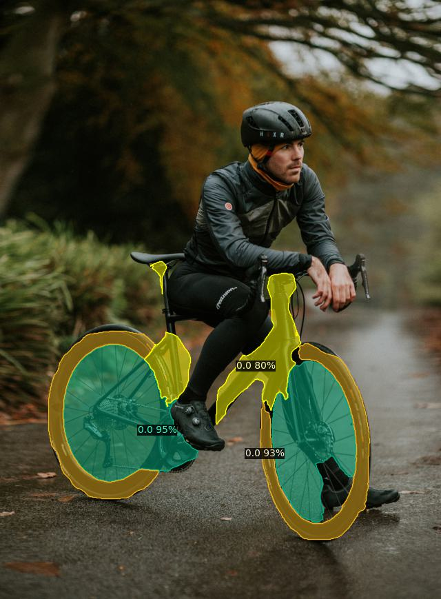
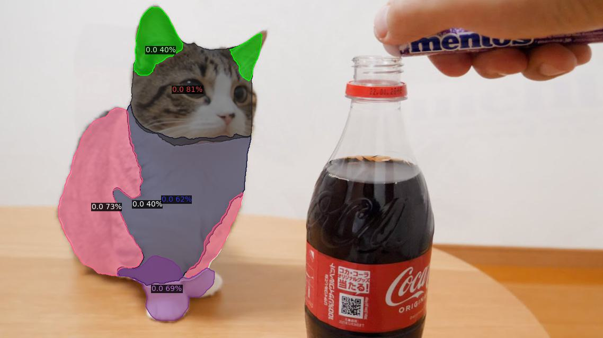
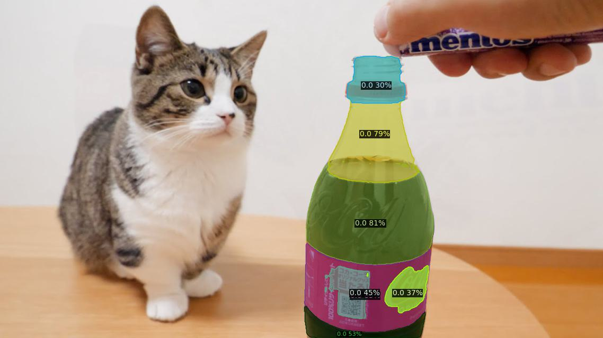
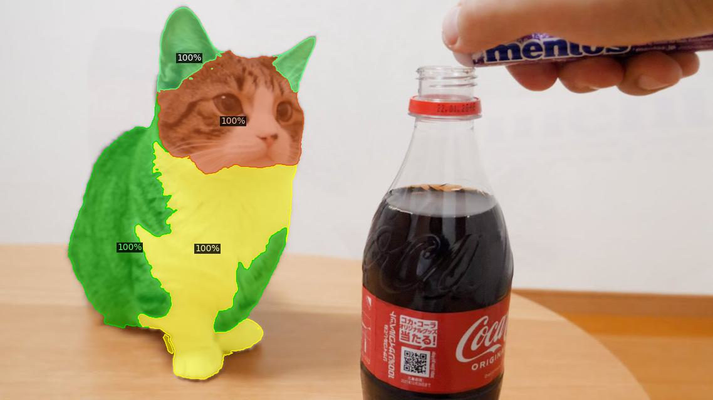
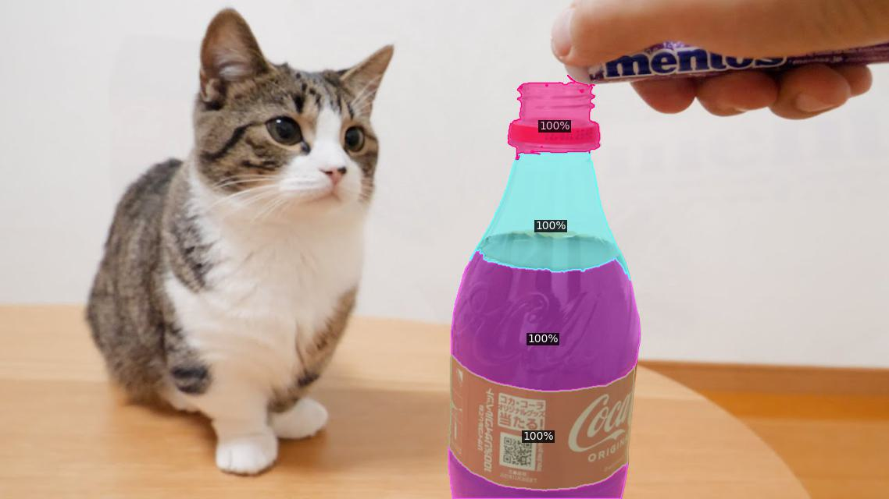

# PartDistillation DEMO 

Here we provide DEMO for PartDistillation. We use the default [demo interface](https://github.com/facebookresearch/detectron2/blob/main/GETTING_STARTED.md) from detectron2. Please follow [here](WEIGHTS.md) to setup [Detic](https://github.com/facebookresearch/Detic/tree/main), and also download our pre-trained weight [here](https://utexas.box.com/shared/static/ovqrzxm9jwe66l0zjqyofkowk5zvhex1.pth). Please save the weight under `./weights/PartProposalLearning/IN1K+Human/part_proposal_model.pth` (see [here](https://github.com/janghyuncho/PartDistillation/blob/9560d4fd2a79d456c88dd1239b7f9cdc7f5c58d4/part_distillation_demo.py#L114C1-L114C1)).

With an image of a `person` and a `bicycle`: 

<p align="center">  </p>

Use the following command to segment each class:
```
python part_distillation_demo.py --input figs/input/bicycle_person.jpg --output figs/output/part_proposal/bicycle.jpg --vocabulary custom --confidence-threshold 0.1 --part-score-threshold 0.3 --custom_vocabulary bicycle --min-image-size 640 --non-overlapping

python part_distillation_demo.py --input figs/input/bicycle_person.jpg --output figs/output/part_proposal/person.jpg --vocabulary custom --confidence-threshold 0.1 --part-score-threshold 0.3 --custom_vocabulary person --min-image-size 640 --non-overlapping
```

If setup correctly, it should look like this:
<p align="center"> 
    
      
</p>

- `--custom_vcabulary` to segment different object class.
- `--non-overlapping` flag to generate non-overlapping part segmentation. 
- `--dcrf` to further smooth out the boundary. 
- `--part-score-threshold` to filter-out low score parts.

Here are different examples (`cat` and `cola`):
```
python part_distillation_demo.py --input figs/input/cat_and_cola.jpg --output figs/output/part_proposal/cat.jpg --vocabulary custom --confidence-threshold 0.1 --part-score-threshold 0.3 --custom_vocabulary cat --min-image-size 640 

python part_distillation_demo.py --input figs/input/cat_and_cola.jpg --output figs/output/part_proposal/cola.jpg --vocabulary custom --confidence-threshold 0.1 --part-score-threshold 0.3 --custom_vocabulary cola --min-image-size 640 
```
Here we visualize overlapping part segmentation. If setup correctly, it should look like this:

<p align="center"> 
    
      
</p>


### Visualizing Part Segments by Pixel Grouping
We first explore different pre-trained features and their capability of part segmentation. We provide a demo to try out:

```
python part_segment_demo.py --input figs/input/cat_and_cola.jpg --output figs/output/part_segment/cola.jpg --vocabulary custom --confidence-threshold 0.1 --custom_vocabulary cola --min-image-size 640 --k 4 --weight-name coco_instance_seg --dcrf

python part_segment_demo.py --input figs/input/cat_and_cola.jpg --output figs/output/part_segment/cat.jpg --vocabulary custom --confidence-threshold 0.1 --custom_vocabulary cat --min-image-size 640 --k 4 --weight-name coco_instance_seg --dcrf 
```
Above command reads `cat.jpg` image as input, and use [Detic](https://github.com/facebookresearch/Detic/tree/main) to first segment instance of the prompted class (`--custom_vocabulary`, `"cat"` in this case). Then it uses the pre-trained features specified with `--weight-name` to cluster the features to group pixels. 
- `--k` is used for the number of clusters.
- `--dcrf` is used for applying [dense-CRF](https://github.com/lucasb-eyer/pydensecrf) as post-processing. 
- See [here](https://github.com/janghyuncho/PartDistillation/blob/main/part_segment_demo.py#L38) to find the available `weight-name` options. Please download the weights from Mask2Former ([here](https://github.com/facebookresearch/Mask2Former/blob/main/MODEL_ZOO.md)) and place them under `./weights/...` (see [here](./WEIGHTS.md)). 

If setup correctly, the result should look like below:

<p align="center"> 
     
    
 </p>
