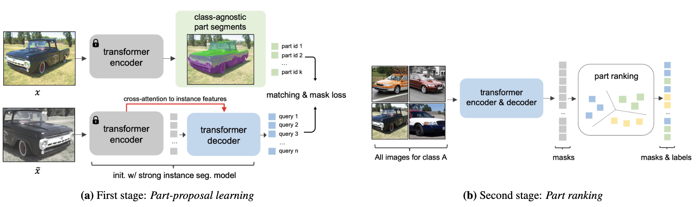

# Training **PartDistillation** on ImageNet-1K

<p align="center">  </p>

Since training on the entire ImageNet-21K is too compute-intense, we provide **compute-friendly training** that matches the zero-shot performance reported in the paper. 
Here, we train on a single 8-GPU machine each with 24GB memory (NVIDIA RTX A5000) on ImageNet-1K dataset.


### Introduction 
PartDistillation has multiple stages to train the full model:
- [Preparing object instance segmentation](https://github.com/facebookresearch/PartDistillation/docs/TRAINING_1K.md#save-detic-predictions-of-imagenet-1k-classes)
- [Getting part segments](https://github.com/facebookresearch/PartDistillation/docs/TRAINING_1K.md#pixel-grouping-for-class-agnostic-part-segments)
- [Part-proposal learning](https://github.com/facebookresearch/PartDistillation/docs/TRAINING_1K.md#part-proposal-learning)
- [Part ranking](https://github.com/facebookresearch/PartDistillation/docs/TRAINING_1K.md#part-ranking)
- [PartDistillation](https://github.com/facebookresearch/PartDistillation/docs/TRAINING_1K.md#partdistillation-training)

#### Weights and Biases 
If [Weights and Biases](https://wandb.ai/site) is setup, each command contains options for visualization. See [here](https://github.com/facebookresearch/PartDistillation/part_distillation/config.py#L127) for W&B-related configuration. 

### Dataset Names 
For training, we provide the following dataset.

#### Self-supervised Learning
- `imagenet_1k_train` 
- `imagenet_22k_train` 

#### Supervised Learning
- `pascal_part_train`
- `part_imagenet_train`
- `cityscapes_part_train` 

For evaluation:
- `pascal_part_val`
- `part_imagenet_valtest`
- `cityscapes_part_val` 


### Save detic predictions of ImageNet-1K classes
Parts are separated with object segmentation and we use [Detic](https://github.com/facebookresearch/Detic) predictions to do the job. 
This allows to learn and segment parts in scene-centric images with multiple objects.
To expedite the training process, we first save all detic predictions of ImageNet. 

First, we need to download pretrained detic weight (see [here](WEIGHTS.md) for the instruction). 
Then, use the pretrained Detic model to precompute object instance segmentation by using `"a [class name]"` as custom text embedding. 

```
python detic_labeling_net.py --config-file configs/DeticLabeling.yaml --num-gpus 8 --num-machines 1 --eval-only 
``` 
Above command launches a single job on 8 GPUs and save predictions at `./pseudo_labels` as default. Change `PROPOSAL_GENERATION.ROOT_FOLDER_NAME` to a symlink folder with enough storage (i.e., `ln -s /path/to/storage/ pseudo_labels`). 

#### Save detic predictions of human class
One important difference between ImageNet-21K and ImageNet-1K is that there is no class related to human in 1K. 
However, there are plenty of human objects in the background of images and we can still obtain the segmentation by following the command below. 

```
python detic_labeling_net.py --config-file configs/DeticLabeling.yaml --num-gpus 8 --num-machines 1 --eval-only \
PROPOSAL_GENERATION.DETIC_LABELING_MODE "human-only" \
PROPOSAL_GENERATION.SAVE_SCORE_THRESHOLD 0.3  
```
Above command uses `human, man, woman, toddler, person` as text embedding and store predictions with confidence higher than `0.3`.

#### Multi-processing 
The major bottleneck in saving predictions is writing the files (i.e., CPU). 
If enough resource is available, use the following code:
```
TOTAL_JOBS=10 
for JOB_ID in 0 1 2 3 4 5 6 7 8 9
do 
    python multi_node_train_net.py --config-file configs/DeticLabeling.yaml --num-gpus 8 --num-machines 1 --eval-only --target "detic_labeling_net.py" --job-dir "output/detic/" \
    PROPOSAL_GENERATION.PARTITION_INDEX ${JOB_ID} \
    PROPOSAL_GENERATION.TOTAL_PARTTITIONS ${TOTAL_JOBS}
done 
``` 
Above command splits the dataset into `TOTAL_JOBS=10` and launch multi-node jobs using slurm. If slurm is not available, just launch multiple jobs manually with different `JOB_ID` (indexed from 0 to `TOTAL_JOBS`-1) each time. 


### Pixel grouping for class-agnostic part segments 
From our [initial analysis](ANALYSIS.md), we show that a strong, transformer-based instance segmentation model has strong part-level signals in its feature. To better leverage this, we use a pre-trained Mask2Former model and group the pixel-level features for each object instance mask. 

First, please download a pre-trained Mask2Former weight (see [here](WEIGHTS.md)). Then, use the following commands to save part segments. 

```
# max-gt-label
python proposal_generation_net.py --config-file configs/ProposalGeneration.yaml --num-gpus 8 --num-machines 1 --eval-only \
PROPOSAL_GENERATION.DETIC_LABELING_MODE "max-gt-label" \
PROPOSAL_GENERATION.OBJECT_MASK_PATH "pseudo_labels/object_labels/detic_predictions/max-gt-label/imagenet_1k_train/"

# human-only
python proposal_generation_net.py --config-file configs/ProposalGeneration.yaml --num-gpus 8 --num-machines 1 --eval-only \
PROPOSAL_GENERATION.DETIC_LABELING_MODE "human-only" \
PROPOSAL_GENERATION.OBJECT_MASK_PATH "pseudo_labels/object_labels/detic_predictions/human-only/imagenet_1k_train/"
```
Above, each command launches a single job on 8 GPUs. If W&B is setup, set `WANDB.DISABLE_WANDB` to `False` and use `WANDB.VIS_PERIOD_TEST` to visualize the generated part segments. For example, `WANDB.VIS_PERIOD_TEST 2000` will visualize every 2000 iterations. 
- *NOTE: Similar to above, use `PROPOSAL_GENERATION.PARTITION_INDEX` and `PROPOSAL_GENERATION.TOTAL_PARTTITIONS` for multi-processing.*


#### Post-processing part segments.
We post-process the part segments to smooth the boundary with [dense-CRF](https://github.com/lucasb-eyer/pydensecrf). Since this is a CPU-only job, we provide multi-processing job as below:
 
```
TOT_IDS=20

# max-gt-label
for ID in 0 1 2 3 4 5 6 7 8 9 10 11 12 13 14 15 16 17 18 19
do
    python3 continuously_postprocess_dcrf.py --dataset_name "imagenet_1k_train" --parallel_job_id $ID --num_parallel_jobs $TOT_IDS --res "res3_res4" --num_k 4 --root_folder_name "pseudo_labels" --label_mode 'max-gt-label' &
done

# human-only
for ID in 0 1 2 3 4 5 6 7 8 9 10 11 12 13 14 15 16 17 18 19
do
    python3 continuously_postprocess_dcrf.py --dataset_name "imagenet_1k_train" --parallel_job_id $ID --num_parallel_jobs $TOT_IDS --res "res3_res4" --num_k 4 --root_folder_name "pseudo_labels" --label_mode 'human-only' &
done
``` 
Above commands launch 20 parallel CPU jobs each. 


### Part-proposal Learning
Here, we start training [Part-proposal Learning](../part_distillation/proposal_model.py) (1st stage), which is a class-agnostic part segmentation model. 
We re-purpose Mask2Former as a part-segmentation model by training with the generated part segments above as annotations.
Just like two-stage object detector, the model learns to predict *all possible part regions* by training with a large amount of images. 
This way, the model learns to:
- (1) sharpen the part segments.
- (2) represent the region as a single vector (*query feature*), similar to box-level feature in two-stage detectors. 
- (3) estimate the *likelihood* as a confidence score. 

To train part-proposal model, follow the command below:

```
python part_proposal_train_net.py --config-file configs/PartProposalLearning.yaml --num-gpus 8 --num-machines 1 
```
Above code will train on a single node with 64 batch size. Check out [config](../configs/proposal_learning/swinL_IN21K_384_mask2former.yaml) to see the default setting. Above command uses the [default pseudo-label paths](https://github.com/facebookresearch/PartDistillation/configs/PartProposalLearning.yaml#L21). 
After training, move the final weight to `./weights/PartProposalLearning/IN1K+Human/part_proposal_model.pth`. 

### Part Ranking
Then, we associate predicted part proposals across dataset for each object class. 
This allows to produce consistent class label for each part during inference. We call this process [Part Ranking](../part_distillation/part_ranking_model.py).
We use the [*part-level features*](https://github.com/facebookresearch/PartDistillation/part_distillation/part_ranking_model.py#L244) to cluster the predicted parts for each object class. 
To further reduce clustering noise, we apply:
- (1) score threshold [before](https://github.com/facebookresearch/PartDistillation/part_distillation/part_ranking_model.py#L388) and [after](https://github.com/facebookresearch/PartDistillation/part_distillation/part_ranking_model.py#L336) clustering
- (2) sample pixel-wise maximum part [before](https://github.com/facebookresearch/PartDistillation/part_distillation/part_ranking_model.py#L370) and [after](https://github.com/facebookresearch/PartDistillation/part_distillation/part_ranking_model.py#L316) clustering

To run Part Ranking, use the following command:
```
python part_ranking_train_net.py --config-file configs/PartRanking.yaml --num-gpus 8 --num-machines 1 --eval-only 
```
Again, you can multi-process this step with `PART_RANKING.TOTAL_PARTITIONS` and `PART_RANKING.PARTITION_INDEX`. If W&B is setup, use `WANDB.VIS_PERIOD_TRAIN` and `WANDB.VIS_PERIOD_TEST` after setting `WANDB.DISABLE_WANDB` to `False`. 
- *NOTE: Generated labels are saved under [this directory](https://github.com/facebookresearch/PartDistillation/part_distillation/config.py#L232) (see [here](https://github.com/facebookresearch/PartDistillation/part_distillation/part_ranking_model.py#L95)).*

### PartDistillation Training
Now, we use self-training to build class-specific part segmentation model. 

```
python part_distillation_train_net.py --config-file configs/PartDistillation.yaml --num-gpus 8 --num-machines 1 --num-machines 1 
```

This command launches a single node job training with 32 batch size. 

### Benchmark Training and Evaluation 
For training baselines and evaluation, see [Benchmark Training and Evaluation](BENCHMARK.md) and [Model Zoo](MODELZOO.md).